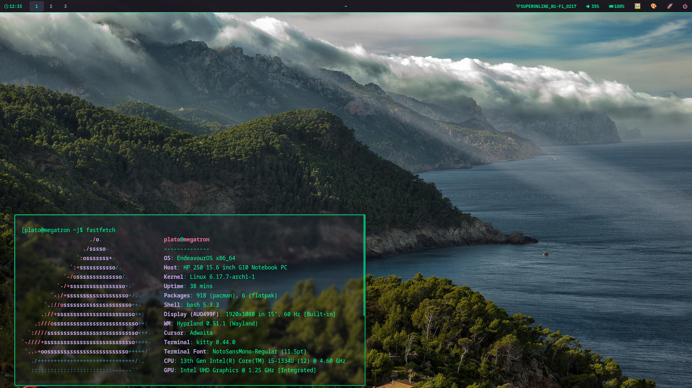

# 🚀 Hyprdots

**Modern Hyprland configuration for Arch Linux.**

## 🖼️ Screenshot

## 🎯 Keybinds

- **Super + Enter**: Terminal
- **Super + R**: App launcher
- **Print**: Screenshot + edit
- **Super + Shift + Print**: Area screenshot + edit
- **Super + Shift + P**: Performance mode

## 🛠️ Scripts

- **wallpaper.sh**: Wallpaper selector
- **performance-mode.sh**: Performance toggle
- **theme-switcher.sh**: Color switcher

