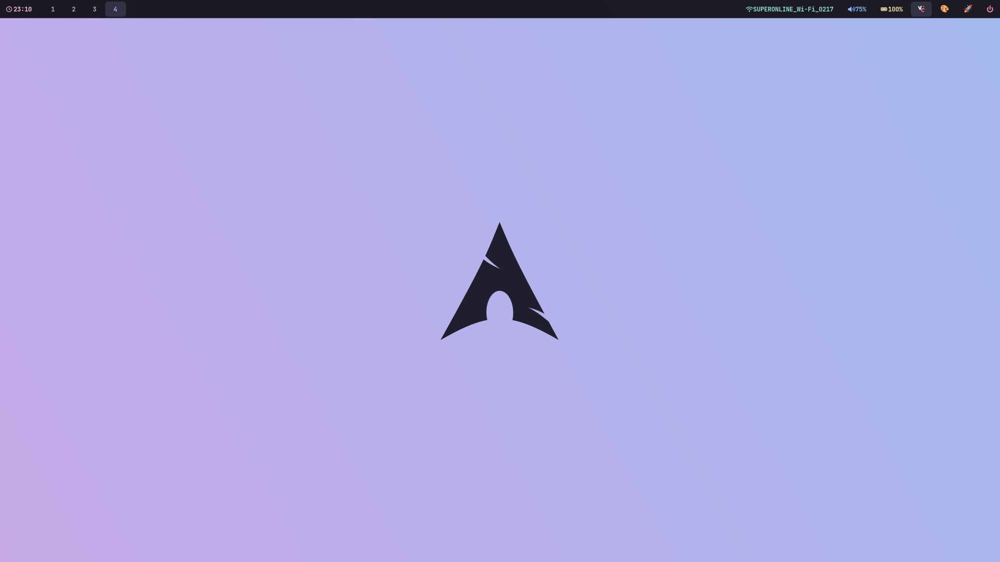

# 🚀 Hyprdots

**Modern Hyprland configuration for Arch Linux.**

## ✨ Features

- 🎨 **Catppuccin Mocha theme**
- ⚡ **Performance mode toggle**
- 🖼️ **Wallpaper selector**
- ⌨️ **Multiple keyboard layouts**
- 🔄 **Auto-update script**

## 🖼️ Screenshot

## 🚀 Installation

git clone https://github.com/58plato/hyprdots.git
cd hyprdots
chmod +x install.sh
./install.sh

## 🔄 Update

To update your Hyprdots configuration:

cd hyprdots
./update.sh

**Update script features:**
- ✅ Creates backup of your current config
- ✅ Pulls latest changes from GitHub
- ✅ Preserves your keyboard layout
- ✅ Updates config files automatically
- ✅ Reloads Hyprland and services

**Manual update:**
cd hyprdots
git pull origin main
cp -r hyprland.conf ~/.config/hypr/
cp -r scripts/* ~/.config/hypr/scripts/
hyprctl reload

## 🎯 Keybinds

- **Super + Enter**: Terminal
- **Super + R**: App launcher
- **Print**: Screenshot + edit
- **Super + Shift + Print**: Area screenshot + edit
- **Super + Shift + P**: Performance mode

## 🛠️ Scripts

- **wallpaper.sh**: Wallpaper selector
- **performance-mode.sh**: Performance toggle
- **update.sh**: Auto-update

## 🎨 Customization
